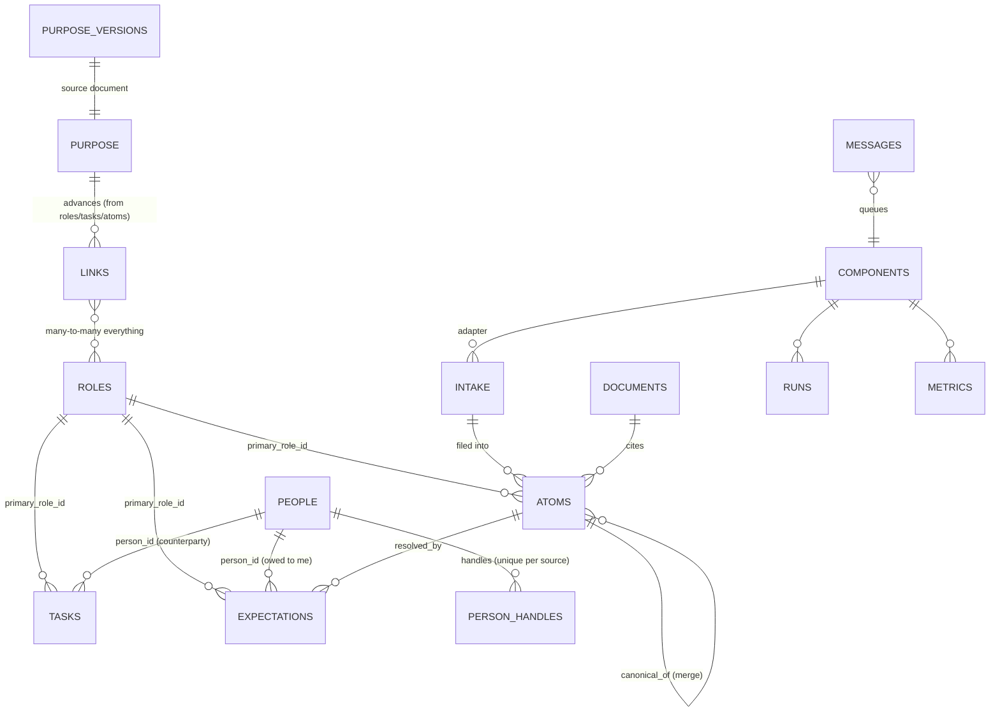

# 01 — Schema

One Postgres database (`claudio`). Three planes: **purpose** (the contract), **life** (the record), **system** (the system's model of itself). Every table and column gets `COMMENT ON` *including 2–3 example calls/values*; the catalog gardener keeps `SCHEMA.md` generated from live schema + comments **with sample rows per table** (schema-in-context measurably reduces agent hallucination — research-traversal §1).

## The entity map



(All many-to-many edges run through `links`; 1-many spine rides real FK columns — inheritance rides the FKs so agents make fewer judgment calls.)

## Conventions

- `id`: uuid for volume tables; human-readable slugs for `roles`, `purpose`, `components` (semantic identifiers measurably beat bare UUIDs for agent precision — research-traversal §1).
- Every table: `created_at`, `updated_at` (trigger), `meta jsonb not null default '{}'`.
- `sensitivity smallint not null default 0` — 0 normal, 1 sensitive, 2 restricted. RLS: `sensitivity <= l1.clearance()` (STABLE SECURITY DEFINER lookup of `role_clearances` by **`session_user`**; no GUC). `FORCE ROW LEVEL SECURITY` everywhere labeled; all worker-facing views `security_invoker = true`. Write floor server-clamped: `greatest(passed, window_default, role_default)`; only panel/core may lower.
- **Nothing exists without a typecheck**: statuses = CHECK; kinds = `kinds` rows, trigger-validated; every jsonb payload (refs, batch shapes, packet, trigger configs) validated against a JSON Schema by trigger/function; contract tests on every L1 function. (Generated TS types arrive with their first consumer, the P3 panel; no Python consumer is specced.)
- **Kind/flag discipline** (taste rule): vocabularies are deliberately small, OS-edited only (core sessions), each kind documents exactly what it applies to, and every domain carries a default `unknown` that agents are instructed to bias toward. Filterable flags are expensive to maintain — create them reluctantly.
- Provenance: `created_by` trigger-set to `session_user`; `source_ref jsonb` shape `{"source","locator","tool"}`, schema-checked.
- **Deletion & supersedence**: entity tables soft-delete via `status`. Inferred links and amended facts are **invalidated, not erased** (`invalidated_at`, `superseded_by`) — point-in-time queries survive (research-traversal §3.6). `person_handles` may hard-delete via L1 (audited). `purge()` (core-only) is the privacy override.
- Every `SECURITY DEFINER` function pins `SET search_path = pg_catalog, l1`. `REVOKE TEMP/CREATE ... FROM PUBLIC`.

```sql
create table kinds (
  domain      text not null,   -- 'atom' | 'link' | 'relationship' | 'page' | 'message' | 'metric' | 'purpose'
  key         text not null,
  description text not null,   -- includes: what it applies to, 2 examples
  status      text not null default 'active' check (status in ('active','retired')),
  primary key (domain, key)
);
```

Seed vocab (small; grows only by proposal): `atom`: meeting, conversation, session, trip, capture, communication, observation, artifact, agent_action, unknown · `link`: member, participant, about, advances, scoped_to, part_of, derived_from, blocks, unknown · `relationship`: knows, family, introduced_by, colleague, unknown · `page`: person, topic, significant_event, digest, index, unknown · `message`: handoff, proposal, notification, alert, question · `purpose`: goal, value, attribute.

`advances` is the alignment edge (role/task/atom → purpose). `about` is generic aboutness.

## Purpose plane (the apex contract — sensitivity 2)

```sql
create table purpose (
  id            text primary key,        -- slug: 'solve-poverty-malawi', 'value-family-time', 'attr-humility'
  kind          text not null,           -- vocab 'purpose': goal | value | attribute
  statement     text not null,
  horizon       text check (horizon in ('life','year','quarter')),   -- goals only
  goalposts     jsonb not null default '[]',   -- attributes: observable markers of progress
  priority_rank integer,                  -- non-null rows form THE priorities list
  status        text not null default 'active' check (status in ('active','achieved','retired')),
  sensitivity   smallint not null default 2,
  ...conventions
);

create table purpose_versions (
  id         uuid primary key,
  version    integer not null,
  body       text not null,              -- the single markdown source doc: "what matters most"
  created_at timestamptz not null default now(),
  sensitivity smallint not null default 2
);
```

- Replaces the old `goals` table; `advances` links now target `purpose` rows.
- **Write access**: user-set functions only (dictation gate / panel / mirror elicitation sessions, `02`/`03`). No agent, gardener, or workflow can modify the contract. Nothing in the system overrides it.
- **Lived-vs-proclaimed is derived, never stored mutable**: `v_purpose_alignment` (purpose row → linked-activity share, last-advanced, drift flags from `metrics`) is computed; discrepancy history is recorded as observation atoms + the wiki purpose/progress chapters. (P9: a derived view cannot go stale independently.)
- What flows into everyday packets is the distilled slice (priorities list, goal/value statements via `advances`); the raw source document is mirror/core/panel-readable only.
- **Absent/stale degraded mode**: packets are valid with empty `taste.purpose`; `v_purpose_alignment` surfaces `purpose_versions` age, so an empty or stale contract is itself the first finding the mirror's observational mode reports.

## Life plane

```sql
create table roles (
  id        text primary key,            -- 'prod', 'disciple', 'husband-father', 'student', 'general'
  name      text not null,
  status    text not null default 'active' check (status in ('active','retired')),
  summary   text check (char_length(summary) <= 500),
  weight    real not null default 1.0,   -- USER-SET (asserted, dictation/panel): how much this role
                                         -- matters in the life. The taste multiplier in packet scoring;
                                         -- never inferred, never model-adjusted.
  default_sensitivity smallint not null default 0,
  ...conventions
);
-- 'general' is the catch-all role every window may map to. Retiring a role suspends its
-- components; it NEVER archives wiki pages or atoms — active-roles is a default filter, not a wall.

create table people (
  id        uuid primary key,
  name      text not null,
  status    text not null default 'active' check (status in ('active','archived')),
  summary   text check (char_length(summary) <= 500),
  verified_fields text[] not null default '{}',
  ...conventions
);

create table person_handles (
  person_id uuid not null references people(id),
  source    text not null,               -- 'imessage' | 'gmail' | 'slack' | 'alias' | ...
  handle    text not null,
  verified  boolean not null default false,
  primary key (source, handle)           -- a handle belongs to exactly one person: the dedup law
);

create table directives (
  id         uuid primary key,
  statement  text not null,
  scope_type text not null check (scope_type in ('global','role','workflow','person','approval_class')),
  scope_id   text check (scope_id is not null or scope_type = 'global'),
  status     text not null default 'active' check (status in ('active','expired','retired')),
  expires_at timestamptz,
  ...conventions
);

create table tasks (
  id              uuid primary key,
  description     text not null,
  status          text not null default 'open' check (status in ('open','done','dropped')),
  due             timestamptz,
  person_id       uuid references people(id),    -- counterparty/beneficiary; whom it's owed to when a commitment
  primary_role_id text references roles(id),
  source_ref      jsonb,
  ...conventions
);

create table expectations (
  id              uuid primary key,
  description     text not null,
  person_id       uuid references people(id),    -- owed TO me (nullable)
  due             timestamptz,
  follow_up       text not null default 'none' check (follow_up in ('none','remind','auto_task')),
  follow_up_at    timestamptz,
  status          text not null default 'pending' check (status in ('pending','met','missed','dropped')),
  resolved_by     uuid references atoms(id),
  primary_role_id text references roles(id),
  source_ref      jsonb,
  ...conventions
);

create table atoms (                       -- renamed from log: the table IS the vocabulary word
  id              uuid primary key,
  ts              timestamptz not null,    -- when it happened (event time)
  ts_end          timestamptz,
  kind            text not null,           -- vocab 'atom'
  summary         text not null check (char_length(summary) <= 500),
  detail          text check (char_length(detail) <= 2000),
  quotes          jsonb not null default '[]',  -- VERBATIM spans for load-bearing facts: commitments,
                                                -- dates, amounts, names. Never paraphrased (P8); spans, never the whole thread.
  notable         boolean not null default false,  -- filer-set under P7's "glaringly obvious" bar;
                                                   -- one of the four structural importance inputs (volume never is)
  refs            jsonb not null default '[]',  -- [{source, locator, tool}]
  primary_role_id text references roles(id),
  canonical_of    uuid references atoms(id),    -- non-null ⇒ merged into that atom. Canonical ≡ NULL.
  ...conventions
);
create unique index atoms_source_locator on atoms ((refs->0->>'locator'), kind)
  where refs->0->>'locator' is not null;

create table intake (
  id          uuid primary key,
  received_at timestamptz not null default now(),
  adapter     text not null references components(id),
  sender      jsonb,                     -- {"source","handle","service"}
  raw         text not null,
  raw_ref     jsonb,                     -- pointer into archive/ for large payloads
  status      text not null default 'pending'
              check (status in ('pending','filed','discarded','held')),
  filed_refs  jsonb not null default '[]',
  locator     text,
  ...conventions
);
create unique index intake_dedup on intake (adapter, locator) where locator is not null;
-- Conditional transitions (WHERE status='pending') make concurrent filers lose cleanly.
-- resolve_held_intake records the answer AND flips held → pending. Holds carry a TTL
-- (parameter): aged-out holds auto-file as kind='unknown' low-confidence atoms with
-- meta.unresolved_hold=true — visible and correctable, never parked forever (the user is
-- never inside the ingest spine unboundedly). Captures cap at sensitivity 1; restricted
-- routes to the panel. Filing errors quarantine the ROW, never the filer.

create table documents (
  path        text primary key,          -- 'wiki/people/jane-doe.md'
  kind        text not null,             -- vocab 'page'
  title       text not null,
  chapter     text not null,             -- the top-level chapter that links it (05): every page belongs to one
  entity_type text, entity_id text,      -- anchor; digests: entity_id='<component>/<period>'
  freshness   timestamptz,
  read_moment text,                      -- creation requirement: when will this be read? (anti-accretion, 05)
  status      text not null default 'active' check (status in ('active','demoted','archived')),
  ...conventions
);
create unique index documents_anchor on documents(kind, entity_type, entity_id)
  where entity_id is not null;
```

## The graph: `links`

```sql
create table links (
  id            uuid primary key,
  from_type     text not null check (from_type in ('person','role','purpose','task','expectation','atom','component','directive','document')),
  to_type       text not null check (to_type   in ('person','role','purpose','task','expectation','atom','component','directive','document')),
  -- 'document' makes summary pages link-bearing hubs: daily/monthly/biannual records link their atoms,
  -- roles, and expectations — the queryable longitudinal mid-tier (05 §Summary ladder).
  from_id       text not null,
  to_id         text not null,
  kind          text not null,            -- vocab 'link' or 'relationship'
  origin        text not null check (origin in ('asserted','inferred')),
  confidence    real check ((origin='asserted') or (confidence between 0 and 1)),
  description   text,
  invalidated_at timestamptz,             -- supersedence: inferred links are invalidated, never erased
  superseded_by uuid references links(id),
  ...conventions,
  unique (from_type, from_id, to_type, to_id, kind)
);
create index links_from on links(from_type, from_id) where invalidated_at is null;
create index links_to   on links(to_type, to_id)   where invalidated_at is null;
```

- Endpoint-validation trigger: static branches over the CHECKed type list; "missing" and "above clearance" raise identically (no existence oracle).
- **Asserted beats inferred**; agents create/invalidate inferred only. Person↔person edges: asserted, or explicit evidence (a literal intro) at ≥ 0.9; else propose (P7).

## Inheritance (explicit, so agents make fewer judgment calls)

1. **FK spine**: `primary_role_id` and `person_id` flow downward — a task created from an atom inherits the atom's primary role; an expectation inherits its task's.
2. **Window mapping**: each window declares `role_map` — the dependent type narrowing the candidate set (prod-slack ⇒ prod; school email ⇒ student; iMessage ⇒ candidate set).
3. **Person membership**: a person's role links narrow further (text from the bishop ⇒ church).
4. **Content inference last**, and only above the confidence floor; below it, `unknown`/held (P5: confidence defaults low).

Order = cheapest first; every inherited link is `inferred` with the inheritance path recorded in `meta`.

## Atoms (the precise definition)

One human-meaningful episode: bounded time × coherent purpose × stable participants, from one source.

| Source pattern | Atomization |
|---|---|
| Meeting / call / ended calendar event | 1 atom |
| Chat thread | the thread-day window is the **capture** unit; the filer writes **1..n atoms per window** — default 1, splitting only when purposes are glaringly distinct (morning: scheduling the meeting; evening: debriefing it). User↔claudio thread exempt (captured per message at the edge) |
| Email thread | 1 atom per thread-beat (revival >7 days or purpose shift = new beat) |
| Working session / focus block | 1 atom |
| Trip / multi-day event | 1 umbrella atom + child atoms `part_of` (created after the fact; future events live in gcal) |
| Published artifact | 1 atom (kind `artifact`) + wiki placement |
| Agent action with side effects | 1 atom per run |

- **Never per-message**; per-message stats are window-computed `metrics`.
- **Every non-discarded thread-day yields an atom.** A 75-text family meme day is one one-line atom — cheap, honest, and it feeds the relationship record (friends matter value-wise at zero task-yield). Discard is reserved for zero-life-record content (spam, OTP codes, delivery bots), decided deterministically at the window where possible (`semantics.discard_patterns`); the filer's restraint principle governs *extraction*, never *recording*.
- **Importance is structural, never volumetric.** Message count is not a signal and is never scored. The packet's importance term derives at read time from: `notable` (filer-set, P7's "glaringly obvious" bar — three texts confirming a meeting with a major figure passes; 75 memes never do) + attached obligations (tasks/expectations born from the atom) + links (purpose via `advances`, people, active roles) + user assertions (taste wins). Three texts can outrank a hundred.
- **Atom length does not scale; destination does (P8).** The atom is the index card, never the document — a long paraphrase is exactly the nested-summary decay P8 forbids. Depth ladder: trivial → `summary` only · standard → + `detail` · load-bearing facts → + `quotes` (verbatim spans, never the whole thread) · significant episodes → + a wiki page/section (where "incredibly long" lives, written delta-style with raw atoms in context) · always → `refs` to tier 0, one pointer away, re-ground rule applies.
- **Flood days don't change the rules**: 200 texts is still N conversation atoms. The morning brief's daily digest page (re-derived from the day's atoms, absolute dates) gives consolidation; packet scoring keeps low-importance volume one pointer away. Live state of unclosed windows is visible via intake, not atoms.
- **Quotes discipline (P8)**: load-bearing facts land in `quotes` verbatim at filing time. Workflows re-ground from `refs` before any irreversible/external action — never act off a summary alone.
- Cross-source merges: gardener proposes; auto-merge only ≥ 0.9 with identical time+participants. `merge_atoms` invariants: target canonical, duplicates not targets, no self/cycles. Thresholds live in `parameters`.

## System plane

```sql
create table components (
  id              text primary key,
  kind            text not null check (kind in ('pipe','gardener','workflow','window','surface','tool')),
  circle          text not null check (circle in ('inner','outer')),
  status          text not null default 'enabled' check (status in ('enabled','disabled','retired')),
  definition_path text,
  trigger         jsonb not null default '{"type":"manual"}',   -- cron | queue | query(+cursor) | manual (schema-validated)
  config          jsonb not null default '{}',                  -- role_map, semantics, model tier, batch caps (budget = ONE global ceiling, not per-component)
  reliability     text not null default 'standard' check (reliability in ('standard','critical')),
  ...conventions
);
-- 'window' = data-ingesting adapter (first-class category); 'surface' = outbound adapter.

create table parameters (
  key       text primary key,            -- 'filer.confidence_floor', 'merge.auto_threshold', 'brief.cron', ...
  value     jsonb not null,
  ring      text not null check (ring in ('core','outer')),   -- core rows: core-writable only; outer: panel-editable
  description text not null,
  ...conventions
);
-- THE unified knob registry, seeded minimally: knobs migrate here on first tuning, not by foresight
-- (over-engineering pass). The core ring is the protected home of the fn→class map + arg-predicates.

create table role_clearances (
  role_name text primary key,
  clearance smallint not null check (clearance in (0,1,2))
);

create table runs (
  id           uuid primary key,
  component_id text not null references components(id),
  started_at   timestamptz not null,
  finished_at  timestamptz,
  outcome      text check (outcome in ('ok','failed','degraded','skipped')),
  tokens_in    integer, tokens_out integer, cost_usd numeric(8,4),
  summary      text, error text,
  meta         jsonb not null default '{}'       -- query-trigger cursors live here
);

create table metrics (                    -- BUILT AT P5 (first consumers: reply-lag drift, dashboards).
  component_id text not null references components(id),   -- intake/atoms are durable, so P5 backfills by query;
  day          date not null,                             -- nothing in P1-P4 writes or reads this.
  scope        text not null,
  key          text not null,            -- vocab 'metric'
  value        numeric not null,
  primary key (component_id, day, scope, key)
);

create table messages (
  id                uuid primary key,
  queue             text not null,
  kind              text not null,
  from_actor        text not null,
  payload           jsonb not null,      -- proposals: {"summary","actions":[batch],"evidence":[],"quoted":[]}
  privilege_class   text,                -- DERIVED server-side from actions[].fn; never trusted from payload
  requires_approval boolean not null default false,
  status            text not null default 'posted'
                    check (status in ('posted','claimed','read','done','approved','rejected','expired')),
  posted_at         timestamptz not null default now(),
  claimed_by        text, claimed_at timestamptz, read_at timestamptz, resolved_at timestamptz,
  sensitivity       smallint not null default 0,
  ...conventions
);
-- Approval transitions: session_user ∈ (panel, core, edge-for-low-risk-classes, w_approver-for-
-- standing-classes) per the grants matrix (02). Queue scoping: own queue only; 'user' readable by
-- edge + panel. Leases: expired claims reaped at claim time; watchdog backstops. Delivery ≠ read.
-- Handoffs carry expires_at (per-class parameter) — stale approvals never fire late. Proposals
-- dedup on (from_actor, privilege_class, content_hash) — absence never produces a duplicate pile.
-- privilege_class is derived PER ACTION; the fn→class map + arg-predicates are core-ring parameters.

create table audit (
  id bigserial primary key, at timestamptz not null default now(),
  actor text not null, fn text, table_name text, row_id text, op text, diff jsonb
);
-- Append-only. Write-rate ceilings count trailing-minute audit rows per actor.
```

## Deliberately absent

Groups (roles encode collectives) · calendar mirror · message archive (tier 0 + metrics) · health/finance/places (future; sensitivity tier ready) · embeddings (promotion trigger defined: logged paraphrase misses in `search_people`/`what_happened` ⇒ exact pgvector over atom summaries + FTS via RRF — bolt-on, no re-architecture) · `document_links` mirror (lint parses files) · graph features (decoration — research-wiki) · separate registries/queues (unified) · dispatcher daemon · mutable lived-vs-proclaimed store (derived view) · `doc_path` columns.
