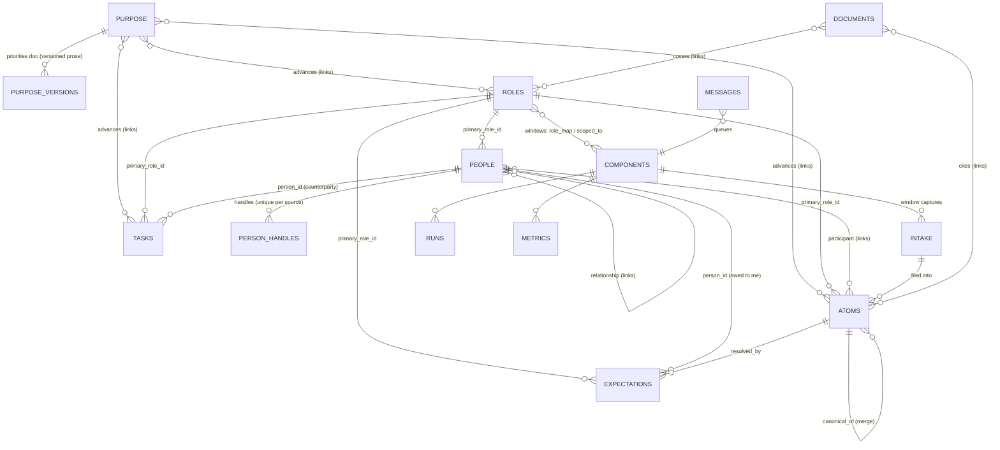

# 01 — Schema

One Postgres database (`claudio`). Three planes: **purpose** (the contract), **life** (the record), **system** (the system's model of itself). Every table and column gets `COMMENT ON` *including 2–3 example calls/values*; the catalog gardener keeps `SCHEMA.md` generated from live schema + comments **with sample rows per table** (schema-in-context measurably reduces agent hallucination — research-traversal §1).

## The entities (described first; relationships in text — then the graph)

Most relationships are technically many-to-many but practically one-to-many: **do one-to-many (an FK column) wherever we can get away with it** — inheritance rides the FK spine so agents make fewer judgment calls; the `links` table carries the genuinely many-to-many remainder.

- **`purpose`** — the apex contract: goals, values/beliefs, attributes. *Relationships:* advanced-by roles/tasks/atoms (`advances` links, M2M); its prose priorities document lives in `purpose_versions` (1-many versions).
- **`roles`** — the organizing spine of the life (prod, disciple, husband-father, student, general). *Relationships:* one-to-many to people (`people.primary_role_id`), tasks, expectations, atoms (each via `primary_role_id`); many-to-many to windows (`config.role_map` — a window feeds one or more roles); many-to-many to purpose (`advances`); secondary role attachments for anything via `links (about)`. User-set `weight` is the taste multiplier in scoring.
- **`people`** — who. *Relationships:* one primary role (FK, practical 1-many); one-to-many handles (`person_handles` — the dedup law: a handle belongs to exactly one person); one-to-many tasks/expectations as the primary counterparty (FK on those tables); additional people on any task/expectation/atom via `links (participant/about)` (the technically-M2M remainder); person↔person via `relationship` links; created by whichever window first sees a new handle (provenance in `created_by` + `meta` — duplicate creations across windows are expected; that's what the merge gardener is for).
- **`atoms`** — units of life experience (definition below). *Relationships:* one primary role (FK); participants via `links (participant)`; may resolve expectations (`expectations.resolved_by`); cited by documents (`links: document → atom`); merge into a canonical (`canonical_of` self-FK); born from intake (`intake.filed_refs`).
- **`tasks`** / **`expectations`** — what I owe / what I'm owed. *Relationships:* one primary person (FK, nullable) + one primary role (FK); extra people/roles via `links`; expectations resolved by atoms; both may `advance` purpose.
- **`directives`** — user taste as operational law. *Relationships:* scoped to global/role/workflow/person/approval_class by `(scope_type, scope_id)`.
- **`documents`** — the 1:1 index row for every wiki page, including the summary ladder (daily/monthly/biannual records). *Relationships:* anchored to an entity or chapter; link-bearing hubs via `links (document → atom/role/expectation/…)`.
- **`intake`** — staging for raw captures before the filer structures them. *Relationships:* belongs to a window (`adapter` FK); produces atoms/tasks/expectations/people via `filed_refs`.
- **`components`** — the system's parts: windows, surfaces, pipes, gardeners, workflows, tools. *Relationships:* role scoping via `links (scoped_to)` and `config.role_map` (windows); one-to-many runs, metrics, intake.
- **`messages`** — the one coordination fabric (handoffs, proposals, questions, alerts). **`runs`** / **`metrics`** / **`audit`** / **`parameters`** / **`kinds`** / **`role_clearances`** — operational records and registries, described in place below.



## Conventions

- `id`: uuid for volume tables; human-readable slugs for `roles`, `purpose`, `components` (semantic identifiers measurably beat bare UUIDs for agent precision).
- Every table: `created_at`, `updated_at` (trigger), `meta jsonb not null default '{}'`.
- `sensitivity smallint not null default 0` — 0 normal, 1 sensitive, 2 restricted (future finance/medical). RLS: `sensitivity <= l1.clearance()` (STABLE SECURITY DEFINER lookup of `role_clearances` by **`session_user`**; no GUC). `FORCE ROW LEVEL SECURITY` everywhere labeled; all worker-facing views `security_invoker = true`. Write floor server-clamped: `greatest(passed, window_default, role_default)`; only panel/core may lower.
- **Nothing exists without a typecheck**: statuses = CHECK; kinds = `kinds` rows, trigger-validated; every jsonb payload (refs, batch shapes, packet, trigger configs) validated against a JSON Schema by trigger/function; contract tests on every L1 function. (Generated TS types arrive with their first consumer, the P3 panel.)
- **Kind/flag discipline** (taste rule): vocabularies deliberately small, OS-edited only (core sessions), each kind documents what it applies to, every domain carries a default `unknown` agents bias toward. Filterable flags are expensive — create them reluctantly.
- Provenance: `created_by` trigger-set to `session_user`; `source_ref jsonb` shape `{"source","locator","tool"}`, schema-checked. **Dereferencing a pointer is always one cheap call** (`02 fetch_ref`) — pulling things in must be dead simple.
- **Deletion & supersedence**: entity tables soft-delete via `status`. Inferred links and amended facts are **invalidated, not erased** (`invalidated_at`, `superseded_by`) — point-in-time queries survive. `person_handles` may hard-delete via L1 (audited). `purge()` (core-only) is the privacy override.
- Every `SECURITY DEFINER` function pins `SET search_path = pg_catalog, l1`. `REVOKE TEMP/CREATE ... FROM PUBLIC`.

```sql
create table kinds (
  domain      text not null,   -- 'atom' | 'link' | 'relationship' | 'page' | 'message' | 'metric' | 'purpose'
  key         text not null,
  description text not null,   -- includes: what it applies to, 2 examples
  status      text not null default 'active' check (status in ('active','retired')),
  primary key (domain, key)
);
```

Seed vocab (small; grows only by proposal): `atom`: meeting, conversation, session, trip, capture, communication, observation, **idea, milestone**, artifact, agent_action, unknown · `link`: member, participant, about, advances, scoped_to, part_of, derived_from, blocks, unknown · `relationship`: knows, family, introduced_by, colleague, unknown · `page`: person, topic, significant_event, digest, index, unknown · `message`: handoff, proposal, notification, alert, question · `purpose`: goal, value, attribute.

`advances` is the alignment edge (role/task/atom → purpose). `about` is generic aboutness (incl. secondary roles).

## Purpose plane (the apex contract)

**Intent**: the canonical statement of what the person's life is for, against which the whole record is typechecked. Four parts — **goals** (different horizons, different types: the aims), **values/beliefs** (core drivers of behavior and key beliefs held true or important), **attributes** (identity-based goals — who I am striving to become, with observable goalposts), and **priorities** (a *prose document*: what is most important and why). The first three are data rows; priorities is prose, versioned. Maintained only with the user, by the mirror. **Readable by every agent — the whole system is mission-aligned** (sensitivity 0; the user's decision: agents should know what the life is for). Writable by no agent, ever: user-set functions only.

```sql
create table purpose (
  id            text primary key,        -- slug: 'solve-poverty-malawi', 'value-family-time', 'attr-humility'
  kind          text not null,           -- vocab 'purpose': goal | value | attribute
  statement     text not null,
  horizon       text check (horizon in ('life','year','quarter')),   -- goals only
  goalposts     jsonb not null default '[]',   -- attributes: observable markers of becoming
  status        text not null default 'active' check (status in ('active','achieved','retired')),
  ...conventions                          -- sensitivity defaults 0: mission alignment
);

create table purpose_versions (           -- THE PRIORITIES DOCUMENT: versioned prose,
  id         uuid primary key,            -- "what matters most to me and why"
  version    integer not null,
  body       text not null,
  created_at timestamptz not null default now()
);
```

- Replaces the old `goals` table; `advances` links target `purpose` rows.
- **Lived-vs-proclaimed is derived, never stored mutable**: `v_purpose_alignment` (purpose row → linked-activity share, last-advanced, drift flags) is computed; discrepancy history lives as observation atoms + the wiki purpose/progress chapters.
- **Absent/stale degraded mode**: packets are valid with empty `taste.purpose`; `v_purpose_alignment` surfaces priorities-doc age, so an empty or stale contract is itself the first finding the mirror reports.

## Life plane

```sql
create table roles (
  id        text primary key,            -- 'prod', 'disciple', 'husband-father', 'student', 'general'
  name      text not null,
  status    text not null default 'active' check (status in ('active','retired')),
  summary   text check (char_length(summary) <= 750),
  weight    real not null default 1.0,   -- USER-SET (asserted): how much this role matters.
                                         -- The taste multiplier in scoring; never inferred, never model-adjusted.
  default_sensitivity smallint not null default 0,
  ...conventions
);
-- 'general' is the catch-all role every window may map to. Retiring a role suspends its
-- components; it NEVER archives wiki pages or atoms — active-roles is a default filter, not a wall.

create table people (
  id              uuid primary key,
  name            text not null,
  status          text not null default 'active' check (status in ('active','archived')),
  summary         text check (char_length(summary) <= 750),
  primary_role_id text references roles(id),   -- practical 1-many; extra roles via links(about)
  verified_fields text[] not null default '{}',
  ...conventions
);

create table person_handles (
  person_id uuid not null references people(id),
  source    text not null,               -- 'imessage' | 'gmail' | 'slack' | 'alias' | ...
  handle    text not null,
  verified  boolean not null default false,
  primary key (source, handle)           -- a handle belongs to exactly one person: the dedup law
);

create table directives (
  id         uuid primary key,
  statement  text not null,
  scope_type text not null check (scope_type in ('global','role','workflow','person','approval_class')),
  scope_id   text check (scope_id is not null or scope_type = 'global'),
  status     text not null default 'active' check (status in ('active','expired','retired')),
  expires_at timestamptz,
  ...conventions
);

create table tasks (
  id              uuid primary key,
  description     text not null,
  status          text not null default 'open' check (status in ('open','done','dropped')),
  due             timestamptz,
  person_id       uuid references people(id),    -- primary counterparty/beneficiary; extras via links
  primary_role_id text references roles(id),
  source_ref      jsonb,
  ...conventions
);

create table expectations (
  id              uuid primary key,
  description     text not null,
  person_id       uuid references people(id),    -- primary person owing me (nullable); extras via links
  due             timestamptz,
  follow_up       text not null default 'none' check (follow_up in ('none','remind','auto_task')),
  follow_up_at    timestamptz,
  status          text not null default 'pending' check (status in ('pending','met','missed','dropped')),
  resolved_by     uuid references atoms(id),
  primary_role_id text references roles(id),
  source_ref      jsonb,
  ...conventions
);

create table atoms (
  id              uuid primary key,
  ts              timestamptz not null,
  ts_end          timestamptz,
  kind            text not null,           -- vocab 'atom'
  summary         text not null check (char_length(summary) <= 750),
  detail          text check (char_length(detail) <= 2000),
  quotes          jsonb not null default '[]',  -- VERBATIM spans for load-bearing facts; never paraphrased (P8)
  notable         boolean not null default false,  -- assigned ONLY at the daily pass (wide longitudinal
                                                   -- context) or by the user; one of the structural
                                                   -- importance inputs (volume never is)
  notable_reason  text,                    -- vocab 'notable_reason' (trigger-validated); CHECK-paired:
                                           -- notable=true ⇔ reason present. P12: the judgment is a
                                           -- SELECTION against the closed list, never prose.
  refs            jsonb not null default '[]',  -- [{source, locator, tool}] — one cheap call to dereference
  primary_role_id text references roles(id),
  canonical_of    uuid references atoms(id),    -- non-null ⇒ merged into that atom. Canonical ≡ NULL.
  ...conventions
);
create unique index atoms_source_locator on atoms ((refs->0->>'locator'), kind)
  where refs->0->>'locator' is not null;

create table intake (
  id          uuid primary key,
  received_at timestamptz not null default now(),
  adapter     text not null references components(id),
  sender      jsonb,                     -- {"source","handle","service"}
  raw         text not null,
  raw_ref     jsonb,
  rawness     text not null default 'verbatim'
              check (rawness in ('verbatim','derived')),   -- derived = AI/agent-summarized upstream (P8: already one summary deep)
  status      text not null default 'pending'
              check (status in ('pending','filed','discarded','held')),
  filed_refs  jsonb not null default '[]',
  locator     text,
  ...conventions
);
create unique index intake_dedup on intake (adapter, locator) where locator is not null;
create index intake_by_day on intake (received_at);
-- Conditional transitions (WHERE status='pending') make concurrent filers lose cleanly.
-- resolve_held_intake flips held → pending. Holds carry a TTL: aged-out holds auto-file as
-- kind='unknown' low-confidence atoms (visible, correctable, never parked forever). Captures cap
-- at sensitivity 1; restricted routes to the panel. Filing errors quarantine the ROW, never the filer.
--
-- INTAKE IS THE TIER-0 RECORD, not disposable staging (P4: the historical stream is owned in-house —
-- external refs rot). Once recorded, rows are never deleted; 'discarded' means no atom was extracted,
-- the raw remains. What should never be recorded at all is dropped pre-capture by window `filters`
-- (06 — term config, deterministic only, drop-counter metric).
-- Large/binary payloads live in archive/ with raw_ref pointing there. Raw is scannable on its own,
-- atoms or no atoms: SQL by day (intake_by_day), grep over archive/. When a window can deliver
-- verbatim, verbatim is the record; rawness='derived' summaries are context, never ground truth.

create table documents (
  path        text primary key,
  kind        text not null,             -- vocab 'page'
  title       text not null,
  chapter     text not null,             -- one of the eleven chapters (05); summary-ladder pages live under 'cadences'
  entity_type text, entity_id text,
  freshness   timestamptz,
  read_moment text,                      -- when will this be read — by Sam (journaling joy) or his agents (a future query)
  status      text not null default 'active' check (status in ('active','demoted','archived')),
  ...conventions
);
create unique index documents_anchor on documents(kind, entity_type, entity_id)
  where entity_id is not null;
```

## The graph: `links`

```sql
create table links (
  id            uuid primary key,
  from_type     text not null check (from_type in ('person','role','purpose','task','expectation','atom','component','directive','document')),
  to_type       text not null check (to_type   in ('person','role','purpose','task','expectation','atom','component','directive','document')),
  from_id       text not null,
  to_id         text not null,
  kind          text not null,            -- vocab 'link' or 'relationship'
  origin        text not null check (origin in ('asserted','inferred')),
  confidence    real check ((origin='asserted') or (confidence between 0 and 1)),
  description   text,
  invalidated_at timestamptz,             -- supersedence: inferred links are invalidated, never erased
  superseded_by uuid references links(id),
  ...conventions,
  unique (from_type, from_id, to_type, to_id, kind)
);
create index links_from on links(from_type, from_id) where invalidated_at is null;
create index links_to   on links(to_type, to_id)   where invalidated_at is null;
```

- Endpoint-validation trigger: static branches over the CHECKed type list; "missing" and "above clearance" raise identically (no existence oracle).
- **Asserted beats inferred**; agents create/invalidate inferred only. Person↔person edges: asserted, or explicit evidence at ≥ 0.9; else propose (P7).

## Inheritance (explicit, so agents make fewer judgment calls)

1. **FK spine**: `primary_role_id` and `person_id` flow downward — a task created from an atom inherits the atom's primary role; an expectation inherits its task's; a new person inherits the discovering window's primary role.
2. **Window mapping**: each window declares `role_map` — the dependent type narrowing the candidate set (prod-slack ⇒ prod; school email ⇒ student; iMessage ⇒ candidate set; anything may map to `general`).
3. **Person membership**: a person's primary role + role links narrow further (text from the bishop ⇒ church).
4. **Content inference last**, only above the confidence floor; below it, `unknown`/held (P5: confidence defaults low).

Order = cheapest first; every inherited link is `inferred` with the inheritance path recorded in `meta`.

## Atoms (the precise definition)

One meaningful chunk that contributes to your day: bounded time × coherent purpose × stable participants, from one source. Can be a single text, can be an hour-long conversation. Could be a 6-hour work session broken into 4 different atoms. Could be a cram study session for an exam. **An atom is a unit of life experience** — not merely a calendar episode: novel ideas, projects, research progress, goals achieved, things found interesting, what's being learned, how time was actually spent (including time wasted watching TV — the record is honest).

Atoms are also **the accounting and directory system over the in-house raw**: ingestion defaults through windows → intake → atoms, and `refs` resolve in-house first. Raw remains independently scannable without atoms (SQL by day, grep over `archive/`) — the directory is the default door, never the only one.

| Source pattern | Atomization |
|---|---|
| Meeting / call / ended calendar event | 1 atom |
| Chat thread | the thread-day window is the **capture** unit; the filer writes 1..n atoms per window — default 1, splitting only when purposes are glaringly distinct |
| Email thread | 1 atom per thread-beat (revival >7 days or purpose shift = new beat) |
| Work / study / focus block | 1 atom per coherent block (a 6-hour session may honestly be several) |
| Leisure / consumption block | 1 atom (an evening of TV is a unit of life experience too) |
| Idea / insight / realization | 1 atom (kind `idea`) — captured thoughts, research directions, things found interesting |
| Goal achieved / milestone | 1 atom (kind `milestone`), usually `advances`-linked |
| Trip / multi-day event | 1 umbrella atom + child atoms `part_of` (after the fact; future events live in gcal) |
| Published artifact | 1 atom (kind `artifact`) + wiki placement |
| Agent action with side effects | 1 atom per run |

- **Bias toward thoughtful, larger chunks** — runaway sprawl of meaningless micro-chunks is the failure mode, not under-splitting. Never per-message; per-message stats are window-computed `metrics`.
- **Every non-discarded thread-day yields at least one atom.** A 75-text family meme day is one one-line atom — cheap, honest, and it feeds the relationship record. Discard is reserved for zero-life-record content (spam, OTP codes, bots), decided deterministically where possible (`semantics.discard_patterns`). The filer's restraint governs *extraction*, never *recording*. The lowest tier is **templated, not generated**: windows with no detected signal (no questions, commitments, new handles) emit their atom from a deterministic template — no LLM pass at all.
- **Importance is structural, never volumetric.** Message count is never scored. The importance term derives at read time from: `notable` + attached obligations + links (purpose, people, roles) + user assertions, multiplied by the user-set role weight. Three texts can outrank a hundred.
- **Atom length does not scale; destination does (P8).** The atom is the index card, never the document. Depth ladder: trivial → `summary` · standard → + `detail` · load-bearing → + `quotes` (verbatim spans) · significant → + a wiki page/section (where long-form lives) · always → `refs`, one cheap call from raw.
- **All judgment calls get longitudinal context**: filing sees recent daily reflections + active expectations; `notable` and splitting are judged at the daily pass with the wide window.
- Cross-source merges: gardener proposes; auto-merge only ≥ 0.9 with identical time+participants. `merge_atoms` invariants: target canonical, duplicates not targets, no cycles.

## System plane

```sql
create table components (
  id              text primary key,
  kind            text not null check (kind in ('pipe','gardener','workflow','window','surface','tool')),
  circle          text not null check (circle in ('inner','outer')),
  status          text not null default 'enabled' check (status in ('enabled','disabled','retired')),
  definition_path text,                  -- the component's own folder: core/agents/<id>/ or custom/agents/<id>/
  trigger         jsonb not null default '{"type":"manual"}',   -- cron | queue | query(+cursor) | manual | resident
  config          jsonb not null default '{}',                  -- role_map, semantics, model tier, batch caps
  reliability     text not null default 'standard' check (reliability in ('standard','critical')),
  ...conventions
);

create table parameters (
  key       text primary key,
  value     jsonb not null,
  ring      text not null check (ring in ('core','outer')),
  description text not null,
  ...conventions
);
-- THE unified knob registry (P10): nothing scattered; seeded minimally, knobs migrate here on first tuning.
-- Core ring (core-writable only) holds the fn→class map, arg-predicates, and security thresholds.

create table role_clearances (
  role_name text primary key,
  clearance smallint not null check (clearance in (0,1,2))
);

create table runs (
  id           uuid primary key,
  component_id text not null references components(id),
  started_at   timestamptz not null,
  finished_at  timestamptz,
  outcome      text check (outcome in ('ok','failed','degraded','skipped')),
  tokens_in    integer, tokens_out integer, cost_usd numeric(8,4),
  summary      text, error text,
  meta         jsonb not null default '{}'       -- query-trigger cursors live here
);

create table metrics (                    -- BUILT AT P5 (first consumers: reply-lag drift, dashboards).
  component_id text not null references components(id),
  day          date not null,
  scope        text not null,
  key          text not null,            -- vocab 'metric'
  value        numeric not null,
  primary key (component_id, day, scope, key)
);

create table messages (
  id                uuid primary key,
  queue             text not null,
  kind              text not null,
  from_actor        text not null,
  payload           jsonb not null,
  privilege_class   text,                -- DERIVED server-side per action; never trusted from payload
  requires_approval boolean not null default false,
  status            text not null default 'posted'
                    check (status in ('posted','claimed','read','done','approved','rejected','expired')),
  posted_at         timestamptz not null default now(),
  claimed_by        text, claimed_at timestamptz, read_at timestamptz, resolved_at timestamptz,
  sensitivity       smallint not null default 0,
  ...conventions
);
-- Approval transitions: session_user ∈ (panel, core, edge-for-low-risk, w_approver-for-standing) per 02.
-- Queue scoping: own queue only; 'user' readable by edge + panel. Leases reaped at claim time;
-- watchdog backstops. Handoffs carry expires_at. Proposals dedup on (from_actor, class, content_hash).

create table audit (
  id bigserial primary key, at timestamptz not null default now(),
  actor text not null, fn text, table_name text, row_id text, op text, diff jsonb
);
-- Append-only. Write-rate ceilings count trailing-minute audit rows per actor.
```

## Deliberately absent

Groups (roles encode collectives) · calendar mirror (live state stays in gcal; ended events become atoms with in-house raw) · health/finance/places (future; sensitivity tier ready) · embeddings (promotion trigger: logged search misses ⇒ exact pgvector + FTS/RRF, bolt-on) · `document_links` mirror (lint parses files) · graph features · separate registries/queues (unified) · dispatcher daemon · mutable lived-vs-proclaimed store (derived view) · `priority_rank` (priorities are prose, not a ranked column) · `doc_path` columns.
